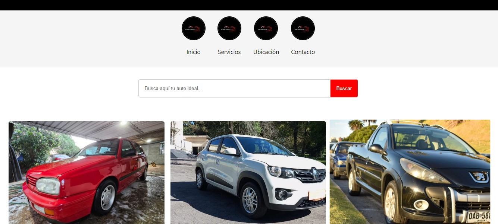
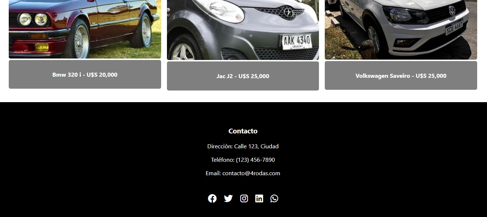

# 4rodas - Automotora Online

¡Bienvenidos a 4rodas, tu automotora online! Este proyecto es un sitio web donde los clientes pueden buscar y encontrar su auto ideal de manera cómoda y familiar; su diseño inspirado en Instagram lo hace amigable e intuitivo: ofrece una experiencia visualmente atractiva y fácil de navegar.

## Características

- **Exploración de Autos:** Los clientes pueden navegar a través de una galería de autos disponibles.
- **Barra de Búsqueda:** Permite a los clientes buscar automóviles específicos.
- **Historias de Autos:** Muestra imágenes de automóviles en un formato circular, similar a las historias de Instagram.
- **Animaciones:** Imágenes de automóviles con animaciones al pasar el cursor.
- **Enlaces a Redes Sociales:** Incluye íconos de redes sociales para fácil acceso.

## Tecnologías Utilizadas

- **HTML5**
- **CSS3**
- **JavaScript**
- **FontAwesome** para los íconos de redes sociales

## Capturas de Pantalla

## Uso

- **Navegación:** Usa la barra de navegación en la parte superior para moverte entre las secciones.
- **Búsqueda:** Introduce palabras clave en la barra de búsqueda para encontrar automóviles específicos.
- **Historias:** Haz clic en las imágenes circulares para ver más detalles de los automóviles.
- **Galería:** Pasa el cursor sobre las imágenes de los automóviles para ver la animación.